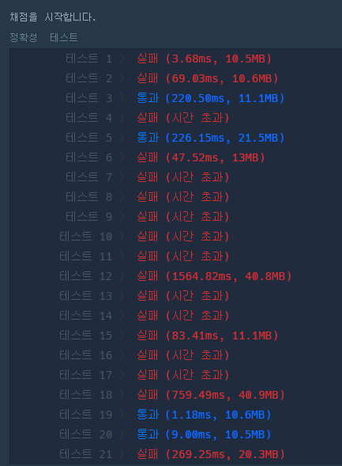
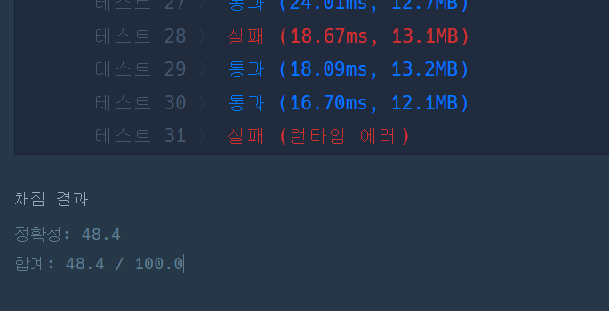
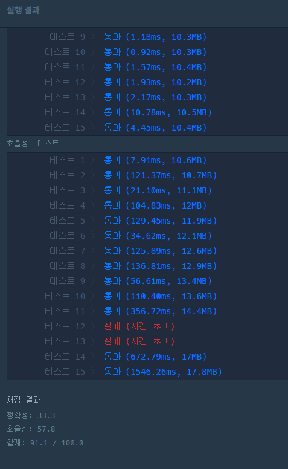
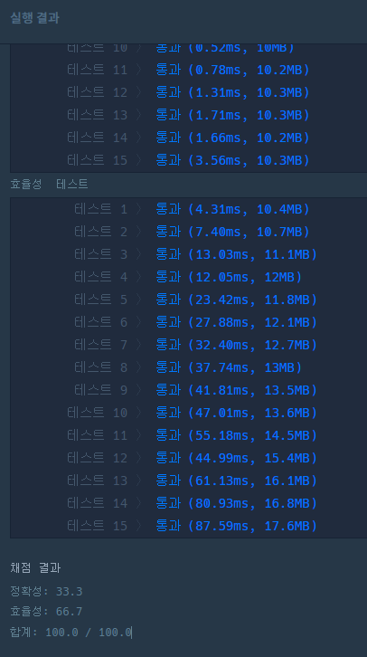

# :grapes: 04.18

## 신규 아이디 추천

- 문자열 처리를 순서에 맞게 했다.
- 왜 틀린거지이이이


## 문자열 압축

- 제일 앞부터 패턴 시작

- 1단위부터 n//2단위까지 모든 경우의 수를 탐색

- 뭐가 틀린걸까

  ```python
  result = result.replace('1', '')
  ```

  십의자리의 1도 빠져버림..

- 1인 경우 처리 안하니까 한 케이스에서 런타임 에러 발생

  ```
  if n == 1:
  	return 1
  ```

  

## 오픈채팅방

**idea**

- 입출 기록은 id로 관리하고
- id의 닉네임을 갱신한다.
  - 닉네임 변경 상황
    1. 채팅방 안에서 닉네임 변경 change
    2. 나갔다가 새로운 닉네임으로 enter


# :herb: 04.25

## Level1. 크레인 인형뽑기 게임

- 같은 인형이 연속해서 들어오면 이전에 들어온 인형을 pop하기 위해 `deque` 을 썼다.

- 근데 `deque`을 안 써도 통과된다!

- 풀이: basket의 마지막 인형인 last와 현재 뽑은 인형인 pick을 비교해서, 둘이 같은 경우엔 basket에서 하나를 pop 하고 answer에 2를 더해주고, 다른 경우엔 pick을 append 한다.

- Point

  - ```
    move -= 1
    ```

    moves의 원소가 1열부터 시작하기 때문에 index 에러가 났다. 그래서 처음에 1씩 뺐다.

  - 방문표시를 -1로 하여 조건문을 `if pick > 0` 으로 처리했다.


## Level1. 실패율

- 런타임에러..?
  - 정렬 시간 문제인가 해서 `heapq`를 써봤는데 적용하고보니`heapq` 는 최소값만 보장하고 전체 정렬을 보장하지 않는다. `heapq`는 아님
  - sort를 두 번 한게 문제인가 해서 lambda로 통합했는데 여전히 런타임 에러 발생.


## Level2. 거리두기 확인하기

- visited 체크를 하며 맨하탄 거리 2까지 **dfs 탐색**
- flag를 통해 하나라도 거리두기가 지켜지지 않은 곳을 찾으면 모든 함수들이 종료되도록 했다.
- 새로 배운 것:`nonlocal`
  - `global` 선언처럼, `nonlocal` 선언을 하면 local 외부의 nonlocal 범위에 접근할 수 있다.


## Level2. 튜플

- idea
  - 튜플의 부분집합들이므로 먼저 길이로 정렬한다.
  - 원소를 순서대로 구하기 위해선 이전 부분집합에 포함되지 않은 원소 하나를 찾으면 된다 -> `set`의 차집합 활용
- 차집합 구하는 법 2가지
  1. `set1 - set2`
  2. `set1.differnece(set2)`

- s 처리
  - string으로 주어진 s를 set으로 만드는 것이 조금 까다로웠다.
  - 먼저 '}' 기준으로 split 했다.
  - `subsets` 라는 리스트를 만들고 그 안에 집합들을 넣었다.


# 05.02

## :world_map: Level1. 비밀지도

- 10진수 -> 2진수 변환을 나눗셈으로 구현했다.
- 그치만 python 내장함수를 이용할 수도 있다!

- 문자열로 출력하는건 `join`을 썼다!


- #### 10진수에서 2진수, 8진수, 16진수 변환

  - bin(), oct(), hex()

  ```python
  >>> bin(42)
  '0b101010'
  >>> oct(42)
  '0o52'
  >>> hex(42)
  '0x2a'
  ```

  - format()

  ```python
  # 접두어 포함된 결과 반환
  >>> format(42, '#b')
  '0b101010'
  >>> format(42, '#o')
  '0o52'
  >>> format(42, '#x')
  '0x2a'
  >>> format(42, '#X')
  '0X2A'
  
  # 접두어 없이 반환
  >>> format(42, 'b')
  '101010'
  >>> format(42, 'o')
  '52'
  >>> format(42, 'x')
  '2a'
  >>> format(42, 'X')
  '2A'
  >>> format(42, 'd')
  '42'
  ```

- #### 다른 진수 형태에서 10진수로 변환

```python
>>> int('0b101010', 2)
42
>>> int('0o52', 8)
42
>>> int('0x2a', 16)
```


## :dart: Level1. 다트게임

- 문자열의 원소를 하나씩 순회하면서 'S', 'D', 'T'를 기준으로 scores에 append하고 score를 초기화 했다.
- 원래는 숫자가 나올 때 append했는데, 십의 자리 이상의 숫자를 쪼개버리는 문제 발생 -> 숫자가 나올 땐 문자열로 더하고, 'S', 'D', 'T' 가 나왔을 때 숫자로 변환하고 append하는 방식으로 바꿈
- '*', '#' 이 나올 땐 scores[-1], scores[-2]를 뽑아서 처리했다.


## :newspaper: Level2. 뉴스 클러스터링

- 다중집합을 허용하기 때문에 set은 못 쓸 것 같다.

- 그럼 교집합을 어떻게 구할까?

  - 집합A를 돌면서 딕셔너리로 카운트하고, 그다음 집합B를 돌면서 겹치는걸 카운트 하는 방식

- 합집합은

  - 카운트한 딕셔너리에 해당 원소가 없으면 합집합에 새로운 원소를 추가하는 방식

- #### 풀이 순서

1. 먼저 set1을 돌면서 `el_count` 딕셔너리에 카운트한다.
2. set2를 돌면서 해당 원소가 `el_count` 에 있으면 교집합 개수인 `inter`를 +1하고, `el_count[el]`에서는 1을 빼준다. (이유: 그래야 양쪽의 다중 중복을 제대로 체크할 수 있다.)
3. 해당 원소가 `el_count`에 없으면 합집합에 새로운 원소를 추가해야하므로 합집합 개수 `union`을  +1 한다.


- 집합 A, B 모두 공집합일 경우를 따로 처리해줘야함


## :shallow_pan_of_food: Level2. 메뉴 리뉴얼

- 부분집합 어케 만들지.. -> 2**n 이진수로 비트 활용
- subsets 딕셔너리로 부분집합 카운트
- 각 길이별로 가장 많이 주문된 조합을 구하기 위해 tmp에서 갱신


# 05.30

##  :musical_score: Level2_방금 그곡

- 런타임 에러.. 문제가 뭔지 모르겠다ㅠ

  

- 놓친 부분

  1. #이 들어간 음 처리

     - in이나 spilt으로 멜로디 포함여부를 검사할 때 #이 붙은걸 하나로 처리하지 못해서 `ABC#` 인데  `ABC`로 검사했을 때 true가 되어버림
     - 또 time에 따라서 music을 이어붙일 때도 1분에 한 음인데 #도 길이에 포함돼서 잘못 계산하고 있었음.

  2. `재생된 시간도 같을 경우 먼저 입력된 음악 제목을 반환한다.`

     - sort 하면 튜플의 0번째 요소로 정렬돼서 이 조건이 충족될 줄 알았는데, 0번째 요소로 정렬된 뒤, 1번째 요소로도 정렬됨.
     - title로는 정렬하지 않으므로 `key=lambda a: a[0]` 을 넣어줘야함.

  3. splite으로 할 때 조건문 부분 때문에 2, 3, 4 등 테스트 케이스가 틀렸다. 

     ```python
     splited = music.split(m)
     if len(splited) == 1:
     	continue
     for i in range(1, len(splited)):
     	if splited[i][0] != '#':
     		result.append((time, title))
     		break
     ```

     조건문 빼고 그냥 split만 썼을 땐 잘 된다.

     ```python
     splited = music.split(m)
     if len(splited) == 1:
         continue
     result.append((time, title))
     ```

     

- 풀이 정리

  - replace로 #이 들어간 음을 다른 문자로 치환
  - 시간 차이만큼 music을 더하거나 슬라이싱한다.

- 느낀 점

  - 풀기 전에 런타임 에러 나면서 테스트 케이스 틀릴 땐 한없이 막막하고 모르겠는데, 막상 풀고나니 당연한 것들을 놓치고 있었다.(# 들어간 음 처리)
  - 문제를 꼼꼼히 읽고, 놓치는 부분 없는지 체크하자.


## :1st_place_medal: Level2_순위 검색 

흠 문제만 읽었을 땐 쉬울 것 같은데.. 한번 풀어보자!


ㅠㅠㅠ 정확성은 통과했는데 효율성이 0점임

- 효율성 올리는 방법
  - 점수로 먼저 필터링한 다음, 나머지 조건을 맞추자.


# 06.06

## :car: Level2. 주차 요금 계산

- 고려해야할 것

1. 주차 요금 계산

   - 기본시간 이상 / 이하로 분기

   - 기본요금 + ⌈(출차-입차 시간) - 기본시간)/단위시간⌉*단위요금

2. 입차만 있는 차는 23:59 출차로 간주

- 어렵지 않은 문제였다!


## :1234: Level2. k진수에서 소수 개수 구하기

#### 순서

1. k진수로 변환
   - k로 나누면서 나머지를 문자열에 더하고, 마지막에 몫을 더하는 방식
2. 0으로 split

3. 소수 판별

- 소수: 1보다 큰 자연수 중, 1과 자기자신으로만 나누어 떨어지는 숫자

- 처음엔 2부터 n-1까지 나눠보는 방법으로 했다.

  -> 시간복잡도 O(n). 숫자가 커지면 비효율적이다. 테스트케이스 1에서 시간초과 발생

- 효율적인 방법: n의 제곱근까지만 확인하면 된다!!

  - 이유: 약수들이 대칭적으로 짝을 이루기 때문에. (4*4=16)

  - 제곱근 계산 방법

    1. `n**(1/2)`

    2. math 라이브러리

       ```python
       import math
       
       math.sqrt(2)
       ```


# 06.13

## :heavy_plus_sign: Level2. 수식 최대화

- 주어진 수식에 들어있는 연산자의 우선순의를 정해 가장 큰 숫자를 만들어내는 문제
- 우선순위 순열을 만들고, 완전탐색을 해서 최대값을 찾아냈다.
- `splited` 에서 계산한 결과를 계산 전 숫자들과 어떻게 치환할지 생각하는 것이 조금 어려웠다.


## :apple: Level2. 괄호 변환

- 함수 3개를 만들었다.
  1. `is_right` : 올바른 괄호 문자열인지 검사하는 함수
     - 싸피 수업 때 했던 괄호 처리를 떠올리며 stack을 썼다.
     - 근데 그냥 cnt로 숫자만 세도 될 것 같다.
  2. `get_reverse` : `(` 와 `)` 방향을 바꾼 결과를 반환하는 함수
  3. `bracket` : 재귀함수
     - 문제에서 알려준 논리대로 구현했다.


## :key: Level2. 후보키

#### idea

- 최소성
  - 최소성을 지키려면 이미 후보키인 속성이 겹치지 않으면 됨
  - 방법
    1) 속성 1개짜리부터 순차적으로 체크
    2) 후보키와 속성이 겹치는 조합은 패스하기
- 유일성
  - set으로 중복 요소가 있는지 검사

#### 틀린 이유

\Programmers\README.assets\image-20220613100450143.png)

```python
for key in candidate_keys:
    a = set(key)
    b = set(comb)
    if len(a & b) > 0:
        flag = 1
        break
```

- 문제: 최소성을 체크하는 부분에서 `if len(a & b) > 0:` 가 문제였다.

- 이유: 교집합이 있기만 하면 걸러냈기 때문. 
  하지만 교집합이 있는지가 아니라 집합 **a가 b에 포함되어있는지**를 확인해야하기 때문에 교집합의 길이가 a의 길이와 같은지를 확인했다.

- 수정

  ```python
  if len(a & b) == len(a):
  ```

  

## :cherry_blossom: Level2. 프렌즈4블록

- 규칙

  - 2*2 형태로 같은 블록이 붙어있으면 터트린다.

  - 터지는 블록이 몇 개인지 구하는 문제

- 풀이 포인트

  - 같은 블록이 여러 2*2에 포함될 수 있으므로 탐색 먼저 한다.

  - 중복되는 블록은 set으로 제거
    - pang_blocks를 sort해 윗행부터 순서대로 터트린다. 그래야 블록들을 올바르게 터트릴 수 있다.
      - 만약 아래 행을 먼저 터트리면, 터트린 자리에 블록들이 아래로 내려오면서 좌표가 변하게 된다. 그럼 아직 남아있는 터트려야할 블록들의 좌표도 변하게 된다.

  - 더 이상 터트릴 게 없을 때까지 반복


# 06.20

## Level2. 캐시

- LRU 알고리즘을 몰라서 공부했다.
- LRU 알고리즘 (Least Recentely Used)
  - 가장 오랫동안 참조되지 않은 페이지를 교체하는 방식

- deque을 써서 구현 가능하다.


## Level2. 압축

- 풀이방법
  - 문제에서 알려준 과정대로 구현했다.
  - i, j 인덱스를 조절해 w를 구했다.
  - 새로운 단어를 사전에 추가할 땐 `len(dicts)+1`를 구했다.

- 알파벳 대문자 리스트

  ```python
  import string
  
  list(string.ascii_uppercase)  # 대문자
  list(string.ascii_lowercase)  # 소문자
  ```

  

## Level3. 합승 택시 요금

- 다익스트라를 쓰는데, 겹치는 경로를 알아야하므로 지나온 경로도 저장해보자 -> 이 방법으로는 합승 시 최소 비용을 구할 수 없다.
- dfs?
  - 같이 타고 가다가 쪼개지는걸 어떻게 판단하고 계산해야하지?
  - 쪼개지는 지점에선 다익스트라(최소거리)를 써볼까

- 성재의 풀이를 보고 아이디어를 얻어 풀었다.

  - idea

  1. 쪼개지는 지점을 x라고 할 때, a와 b가 x까지 같이 갔다가 쪼개져서 각자 집까지 가는 노선의 비용은

     ```
     비용 = d(s, x) + d(x, a) + d(x, b)
     
     s에서 x까지 가는 비용 + x에서 a까지 가는 비용 + x에서 b까지 가는 비용
     ```

  2. 위의 비용을 완전탐색으로 모든 x에 대해 탐색해서 최소값을 찾는다.


## Level3. 자물쇠와 열쇠

- 재미있는 문제군..
- 자물쇠, 열쇠 주변을 n-1만큼 0인 영역으로 미리 둘러싸기

순서

1. 자물쇠에서 홈 부분 패턴 a X b을 탐색
2. 키에서 동일한 패턴이 있는지 검사
3. 키를 회전, 이동하여 자물쇠와 맞을 수 있는지 검사


# 06.27

## :open_file_folder: Level2. 파일명 정렬

- head, number 부분을 분리하는게 핵심이었음
  - `isdigit()`으로 숫자를 판별해서 처리함

- 틀린 이유

  - ```python
    while file[i].isdigit() and i < len(file):
    ```

  - while 반복문에서 `i < len(file)` 조건을 뒤에 넣었기 때문에 `file[i].isdigit()`에서 인덱스 에러가 났던 거였음!

  - 순서를 바꿨더니 해결!


## Level2. n진수 게임

- 숫자를 n진수로 변환하는 함수 `change_number`를 만듬
- n진수 문자열을 쭉 이어붙인 다음, 튜브의 순서에 맞는 문자를 answer에 담았다.
- p를 1 빼줘야 인덱스가 맞음


## :classical_building: Level3. 기둥과 보 설치

- (x, y) 좌표를 (i, j)로 변환할 때 `i, j = n-y, x`로 써야하는데 n을 예제에 있는 5로 하드코딩하는 바람에 한 케이스 빼고 다 틀려서 헤멨음 ㅠ
- 솔직히 코드가 너무 복잡해서 풀기 싫었다 :scream_cat:
- 삭제 시 영향 가는 부분만 검사하는 `delete_check` 함수를 만들었는데 틀려가지고 그냥 전체 검사로 통과했다,,


## Level4. 가사 검색

- 선형탐색을 했을 땐 효율성 테스트의 케이스 3개를 통과 못함.
  - Trie 자료구조를 쓰면 된다고 함
- Trie 트라이
  - 문자열을 빠르게 탐색할 수 있는 트리 형태의 자료구조
  - 사전 검색, 자동완성 기능 등에서 사용
  - 단점: 저장 공간이 크다
  - 장점: 문자열을 빠르게 탐색할 수 있다.


# 07.04

## :film_strip: Level3. 광고 삽입

- 모든 logs를 돌면서 모든 초에 대해 카운트를 저장
- 완전탐색: 모든 구간을 돌며 최대값을 찾는다



- 인덱스 틀린부분 +1 씩 고침
- 


## :gem: Level3. 보석 쇼핑

- 구간의 시작점은 i, 끝점은 j
- 구간의 길이가 최소값을 넘거나, 모든 보석이 포함되면 i를 하나씩 늘리고, 그렇지 않으면 j를 하나씩 늘리는 방식

```python
def solution(gems):
    def check_all_in():
        for v in dicts.values():
            if v < 1:
                return False
        return True

    dicts = {}
    for gem in set(gems):
        dicts[gem] = 0

    min_l = len(gems)+1
    i = j = 0
    answer = []
    while i < len(gems) and j <= len(gems):
        if j < i:
            j = i
        l = j-i
        if l >= min_l:  # 가지치기
            dicts[gems[i]] -= 1
            i += 1
            continue
        if check_all_in():
            min_l = l
            answer = [i+1, j]
            dicts[gems[i]] -= 1
            i += 1
        else:
            if j >= len(gems):
                break
            dicts[gems[j]] += 1
            j += 1

    return answer
```




- 케이스 12, 13을 통과하려면 모든 보석이 포함되어있는지 검사하는걸 for문으로 검사하지말고 딕셔너리의 길이로 검사해야한다. 그래서 cnt가 0이 되면 아예 딕셔너리에서 del 해준다!

  - before

    ```python
    def check_all_in():
        for v in dicts.values():
            if v < 1:
                return False
        return True
    ```

  - after

    ```python
    if len(dicts) == goal:
        min_l = l
        answer = [i+1, j]
        dicts[gems[i]] -= 1
        if dicts[gems[i]] == 0:
            del dicts[gems[i]]
        i += 1
    ```

    




## Level3. 외벽 점검


# 07.11

## :iphone: Level1. 키패드 누르기

- 숫자가 2, 5, 8, 0일 때 왼손 엄지와 오른손 엄지의 위치와 누르려는 숫자 사이의 거리를 비교해서 더 가까운 손으로 누른다.

- 포인트: 숫자 간의 거리를 어떻게 계산할지가 포인트. 번호판은 고정되어있다.
  - 이렇게 저렇게 해보다가 두 숫자의 **절댓값을 3으로 나눈 몫과 나머지를 더한값**이 두 숫자 사이의 거리라는 규칙을 알아냈다!
  - 숫자 키패드가 3Xn 형식이라서 이런 규칙이 생기는 것 같다.


## Level1. 숫자 문자열과 영단어

- 먼저 NUMBERS라는 딕셔너리를 세팅했다.

- 틀렸던 부분

  - `if NUMBERS.get(word, 0):`

    이렇게 했더니 딕셔너리에서 zero를 찾아 0을 반환할 때 조건문에 걸리지 않아서 answer에 더해지지 않았다.

  - 그래서 `if NUMBERS.get(word, -1) != -1:` 이렇게 변경!

  - `if word in NUMBERS:` 가 더 깔끔함!


## Level3. 불량사용자

- 드디어 풀었다..!

- dfs로 풀었다.

- 틀렸던 포인트들

  1. cases에 tuple 형태로 들어가니 순서가 다른데 구성은 같은 튜플들이 중복 제거가 안됐음

     ```python
     tmp = list(set(comb))
     if len(tmp) == len(comb):
     	cases.add(tuple(sorted(tmp)))
     ```

     그래서 set으로 중복제거한 comb를 다시 list로 만들고 정렬을 해서 tuple로 만들었다.

  2. 테스트케이스5 시간초과

     ```python
     if graph[level+1][nj] not in comb:
     ```

     이 조건을 추가해서 해결.


# 07.18

## Level2. 기능개발

- 앞에 있는 기능이 완료되어야 뒤의 기능이 배포될 수 있기 때문에 앞기능부터 순서대로 따진다.
- `day`는 몇일째인지를 나타내는 변수
- 현재 day로 계산을 해서 100을 넘으면 answer[-1]에 1 더하고, 그게 아니라면 day를 재할당한다.


## Level2. 조이스틱

- 알파벳 순서는 그냥 하드코딩하려고 한다.

- 정방향이 빠른지 역방향이 빠른지는 전체의 반절을 기준으로 따지려고한다.
- 이 문제의 포인트는 좌우이동을 어떤 방식으로 선택할 것인가이다.

BBAAABB


## Level3. 셔틀버스 :bus:

- 조건 설정하는게 고민이 많이 됐다.
- 논리가 머리로 생각했을 땐 어렵지 않은데, 구현하는게 조금 복잡했다.
  - 아직 m명이 다 채워지지 않았고, 현재 p번째 사람의 도착시간이 셔틀 도착시간 이하이면 -> 태움
    - 마지막 버스이고, 1명 남았으면 -> 콘의 가장 느린 도착시간을 구한다.
  - 모든 사람을 다 태운 경우 -> 버스의 마지막 타임을 구한다.
  - 마지막 타임인데 아무도 안 태웠으면 -> 버스의 마지막 타임을 구한다.


# 10.04

## :sheep::wolf: Level3_양과 늑대

- 이진트리 형태이지만 트리를 굳이 만들 필요는 없고 간선 정보를 따라가면 된다. -> 간선 정보를 인접리스트로 저장함
- dfs & 백트래킹
  - dfs
    - 조건 하에 모을 수 있는 양의 최대값을 구해야하므로 경로를 끝까지 탐색하는 dfs를 써야한다고 생각했다.
    - 트리를 부모 -> 자식 순으로 순차적으로 방문하는 것이 아니라 방문할 수 있는 모든 노드를 후보로 두어야한다. 그래서 nexts 리스트를 들고 다니면서 특정 node를 방문하면 그 node의 자식 node들을 nexts에 추가하고, return하기 전에는 nexts를 원래의 리스트로 복귀시켰다.
  - 백트래킹
    - 양보다 늑대의 수가 많아지면 가지를 친다.


## 🏹 Level2_양궁대회

- 구해야하는 것: 라이언이 가장 큰 점수차로 이기는 경우 -> 완전탐색

- 완전탐색이지만 각 점수마다 라이언이 쏘는 화살의 경우는 2가지 경우로 나뉜다.

  1. 어피치보다 1발 더 쏘거나
  2. 쏘지 않거나

  - 이렇게 2가지 경우로 탐색하는게 아니라 1발씩 증가시키며 모든 경우를 탐색한다면 시간초과된다,,


# 10.19

## Level1_로또의 최고 순위와 최저 순위

- 0(알아볼 수 없는 번호)의 개수에 따라 최고순위와 최저순위가 결정되는 문제

- 1개 일치하는 경우와 0개 일치하는 경우가 모두 6등으로 처리해야해서 고민이 되었다. 처음에는 아래처럼 if문으로 처리해줬는데 별로 깔끔하지 않다는 생각이 들었다.

  ```python
  max_rank = 7-cnt1-cnt2
  if max_rank > 6:
  	max_rank = 6
  min_rank = 7-cnt1
  if min_rank > 6:
  	min_rank = 6
  answer = [max_rank, min_rank]
  ```

  그래서 다른 사람의 풀이를 보았는데 완전 마음에 드는 방법을 발견했다!

  rank라는 리스트를 만들어서 인덱스에 따라 등수를 알 수 있도록 했다.

  ```python
  rank = [6, 6, 5, 4, 3, 2, 1]
  answer = [rank[cnt1 + cnt2], rank[cnt1]]
  ```

  

## Level3_다단계 칫솔 판매

- 포인트
  1. 자신의 부모가 누구인지 저장하는 배열 parents를 만들었다. 
     - -1은 부모가 민호인 사람
  2. 수익 분배 함수
     - 수익의 10%는 다음 턴으로 넘어가고, 나머지는 현재 사람에게 +
     - while문으로 현재 사람(now)이 민호(-1)가 아닐 때까지 반복
     - 만약 현재 profit이 10이하이면 10% 절사할 것이 없으므로 현재 사람에게 남은걸 모두 더하고 return

- 시간초과 해결
  - enroll의 인덱스를 사람의 번호로 상정했는데 enroll.index(사람이름)으로 했더니 마지막 3개 테스트 케이스에서 시간초과가 났다.
  - enroll의 길이가 최대 10,000이기 때문에 매번 index로 사람의 번호를 찾는게 원인인가 해서 처음에  `'사람 이름': 인덱스` 딕셔너리 형태로 한번 전체 저장을 하고 시작했더니 시간초과 해결!
